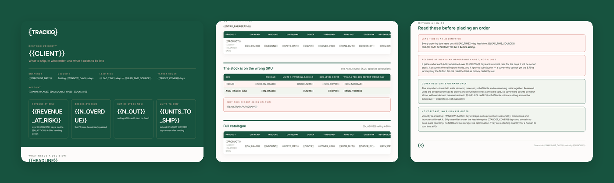

# TrackIQ: Amazon Restock Priority

Answers the Monday morning question: **what do we ship, in what order, and what does being late cost?**

Output is a branded HTML report — the products needing a decision, then the full catalogue, then the shipment quantities. Ranked by revenue at risk, so the list is already in the order someone should work it.

Part of **Amazon Inventory** in the
[TrackIQ skills catalog](https://github.com/TrackIQ-HQ/amazon-seller-skills).

Built as an [Agent Skill](https://code.claude.com/docs/en/skills). Runs in
Claude Code, Claude web, Claude desktop and ChatGPT from the same folder.

---

## Powered by the TrackIQ MCP

[](https://trackiq.com/mcp)

This skill reads your live Amazon account through the
**[TrackIQ MCP](https://trackiq.com/mcp)** — 16 tools connecting your AI
assistant to Amazon data:

Sales & Traffic · Orders · Inventory · Returns · Sponsored Products · Sponsored
Brands · Sponsored Display · Amazon DSP · AMC Cloud · Keywords · Search Terms ·
Targeting · Search Query Performance · Organic Rank · Best Seller Rank · Buy Box
History · Brand Analytics · Export

Works with Claude, ChatGPT and Cursor. **[Get access →](https://trackiq.com/mcp)**

---

## What you get



Works out which Amazon products to ship next and in what order — days of cover at the current sales rate, the date each one runs out, the date a purchase order needed placing to beat it, the revenue exposed if it is late, and a starting shipment quantity per product. Ranked by revenue at risk rather than by days of cover. Use when the user asks about restocking, reordering, replenishment, days of cover, days of supply, what to ship, inventory planning, stockout risk, which products are running low, or when to place a purchase order.

### The rules that keep it honest

- **Compute cover per ASIN, never per SKU**
- **Cover uses `on_hand`. Never `total`**
- **`reserved` is never available**
- **Rank by revenue at risk, not days of cover**

The full list is in `SKILL.md`, and each one exists because getting it wrong
produces a confident, wrong answer rather than an obvious error.

## Requirements

- The TrackIQ MCP, for `list_marketplaces`, `get_inventory_snapshot` and `get_product_performance`. - **A lead time** — days from purchase order to sellable in an FC. Ask for it. It is in no tool, and without it the report can say when stock runs out but not when to order, which is the only part anyone acts on. Default 45 days, labelled an assumption. - Nothing else. No filesystem, no shell, no internet. - **Without the MCP:** works from an FBA inventory export plus units and revenue by ASIN for a trailing month.

---

## Install

### Claude Code

```
/plugin marketplace add TrackIQ-HQ/amazon-seller-skills
/plugin install trackiq-amazon-restock-priority@trackiq
```

### Claude web, desktop, mobile

1. Download the `.zip` from the
   [latest release](https://github.com/TrackIQ-HQ/trackiq-amazon-restock-priority/releases)
2. **Settings → Capabilities → Skills** (code execution must be on)
3. **Create skill → Upload a skill**, choose the `.zip`
4. Toggle it on

### ChatGPT

Same zip. **Plugins → Skills → Create → Upload from your computer.**

---

## Setup

Answers live in `account.md`, copied from
[`assets/account.example.md`](skills/trackiq-amazon-restock-priority/assets/account.example.md).
**Every TrackIQ skill reads the same file**, so an account already set up for
another TrackIQ report needs nothing added.

## Delivery

Asked once and stored in `account.md`: **in-chat** (default), **file**,
**Slack**, **n8n** or **email**. Anything leaving the chat confirms with you
first and falls back to in-chat, with a note.

---

## Customizing

| File | What it controls |
|---|---|
| `checks.md` | the pre-send checks |
| `method.md` | the method and every threshold |
| `pulls.md` | the call sequence and its traps |
| `report-template.html` | the report shell |

---

## Contributing

```bash
python scripts/validate.py    # must exit 0 before any commit
python scripts/build.py       # writes dist/ zip + registry.json
```

Read [AUTHORING.md](https://github.com/TrackIQ-HQ/amazon-seller-skills/blob/main/AUTHORING.md)
before proposing changes.

## License

MIT. See [LICENSE](LICENSE).
